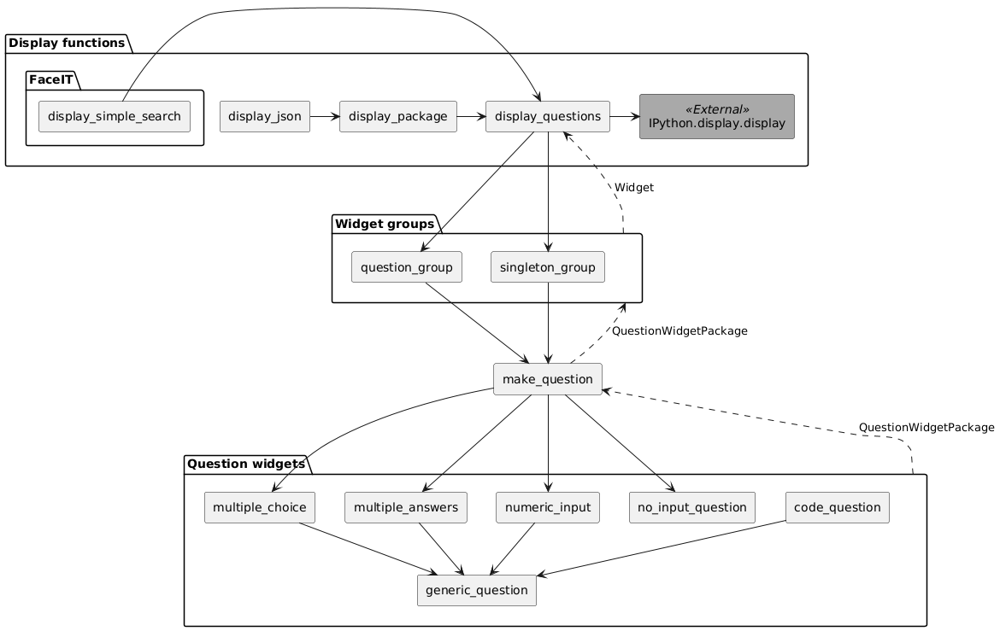
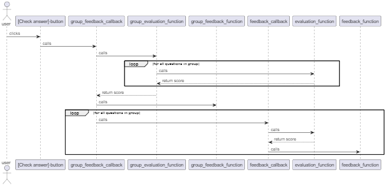

# Architecture
*This document describes in more detail how the package is implemented.*

The following diagram shows how the main abstractions of ipyquizjb are made up, with the hierarchy of which functions call which.

In addition to these top-level functions, some of these functions also return functions or pass functions as arguments to the other functions. 
These are used when the user checks the answer.
The following sequence diagram illustrates their usage.

`generic_question` can be specified with a custom evaluation function and a custom feedback function. 
The evaluation function is a function that evaluates the input widget of the question type and returns a score representing how well the student answered, while the feedback function takes such an evaluation as input and produces a textual feedback that tells the student how well they scored on the question. 
These two functions are then used in `generic_question` to produce the `feedback_callback`, which is the function that actually updates the user interface with the feedback. 
The feedback callback is along with the actual widget and the evaluation function returned from `generic_function` and the rest of the call stack up to the widget group functions in a tuple (shown as QuestionWidgetPackage in the figure).
These feedback callbacks are then attached to the check answer button in the (singleton) group, along with a separate feedback callback for the group itself that handles the evaluation of the group as a whole and displays feedback and potentially additional material based on the combination of the question evaluations.